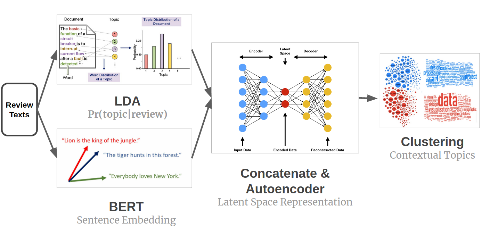
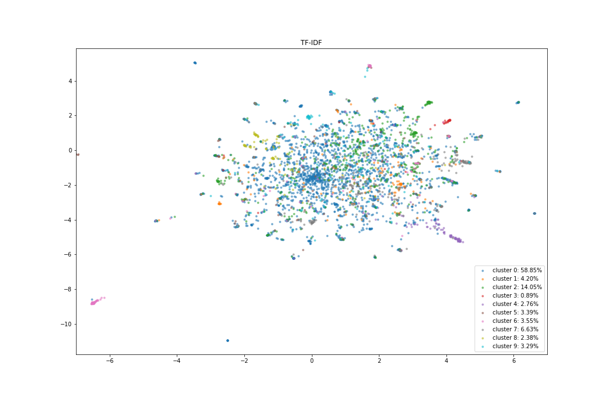
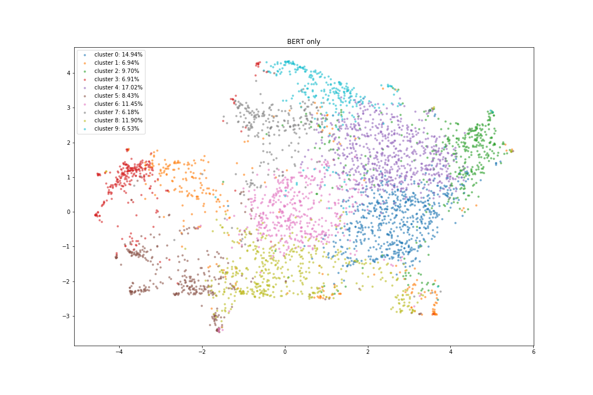
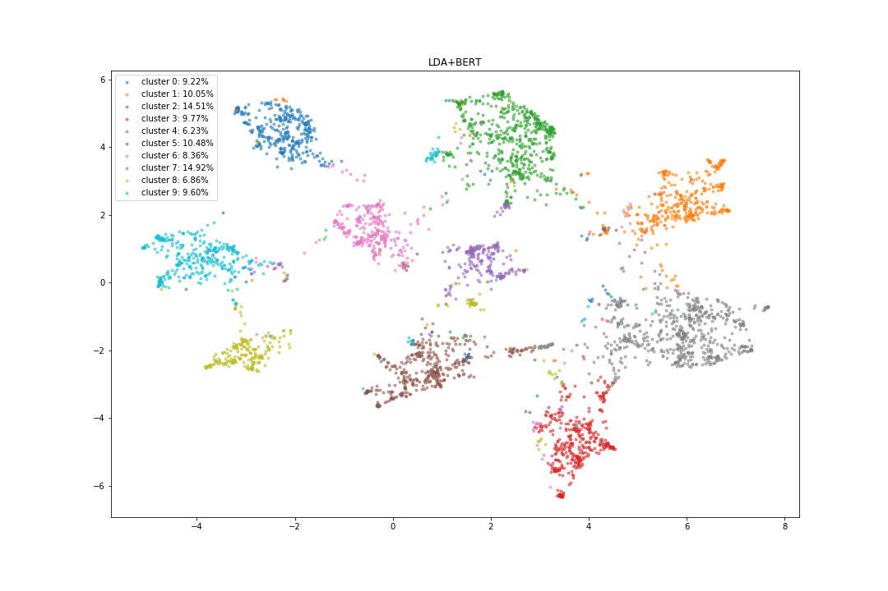

# Contextual Topic Identification for Steam Reviews

This repository is the implementation of contextual topic identification model. The model is based on _LDA_ probabilistic topic assignment and pre-trained sentence embeddings from _BERT/RoBERTa_. The analysis is conducted on the dataset of game reviews on the steam platform.

## Motivation

Product reviews are important as influencing people's choices especially for online shopping. We usually have dreadfully huge numbers of reviews for whatever products. However, many platforms have barely a satisfying categorization system for the reviews when it comes to what the reviewers are really talking about. Steam, for example, has a very carefully designed system where people can do a lot of things, but still there is no such access to categorizing the reviews by their semantic meanings.


Therefore, we provide a topic identification procedure thats combines both bag-of-words and contextual information to explore potential __semantically meaningful__ categories out of the oceans of steam reviews.

## Setup

Clone the repo

```
git clone https://github.com/Stveshawn/contextual_topic_identification.git
cd contextual_topic_identification
```

and make sure you have dataset in the `data` folder (you can specify the path in the bash script later).


To run the model and get trained model objects and visualization

### With Docker

run the bash script on your terminal

```
sudo bash docker_build_run.sh
```

The results will be saved in the `docs` folder with corresponding model id (_Method_Year_Month_Day_Hour_Minute_Second_).

Four parameters can be specified in the bash script

+ `samp_size`: number of reviews used in the model
+ `method={"TFIDF", "LDA", "BERT", "LDA_BERT"}`: method for the topic model
+ `ntopic`: number of topics
+ `fpath=/contextual_topic_identification/data/steam_reviews.csv`: file path to the csv data

To run a test case on the sampled test data, do
```
sudo bash test.sh
```


## Data

The dataset ([Steam review dataset](https://www.kaggle.com/luthfim/steam-reviews-dataset)) is published on Kaggle covering ~480K reviews for 46 best selling video games on steam.

To successfully run the model, you should have this dataset downloaded (kaggle authentication required) and placed in the `data` folder (or specify your own file path in the bash script).

## Model

To identify the potential topics of the target documents, traditional approaches are

+ Latent Dirichlet Allocation

+ Embedding + Clustering

Although LDA generally works well for topic modeling tasks, it fails with short documents, in which there isn’t much text to model and documents that don’t coherently discuss topics. Using only bag-of-words information also make it quite limited. 

The contextual topic identification model leverages both bag-of-words and contextual information by including both the LDA topic probabilities and the sentence embeddings. The model is as follows




where we 

+ take the information from LDA probabilistic topic assignment (`v_1`) and sentence embeddings (`v_2`)
+ concatenate `\lambda * v_1` and `v_2` to get `v_{full}`
+ learn the latent space representation `v_{latent}` of by autoencoder
+ implement clustering on the latent space representations.


## Result

Visualizations (2D UMAP) of clustering results with different vectorization methods with `n_topic=10`

| TF-IDF | BERT | LDA_BERT |
|---|---|---|
 |  | |


Evaluation of different topic identification models with `n_topic=10`


| Metric\Method | TF-IDF + Clustering | LDA | BERT + Clustering | LDA_BERT + Clustering |
|---|---|---|---|---|
|C_Umass|__-2.161__|-5.233|-4.368|-3.394|
|CV|0.538|0.482|0.547|__0.551__|
|Silhouette score|0.025|/|0.063|__0.234__|

## Acknowledgements

### Libraries

[Sentence Transformers](https://github.com/UKPLab/sentence-transformers): Sentence Embeddings using BERT / RoBERTa / DistilBERT / ALBERT / XLNet with PyTorch

[SymSpell](https://github.com/wolfgarbe/SymSpell): 1 million times faster through Symmetric Delete spelling correction algorithm

[Gensim](https://github.com/RaRe-Technologies/gensim): Topic Modelling in Python
